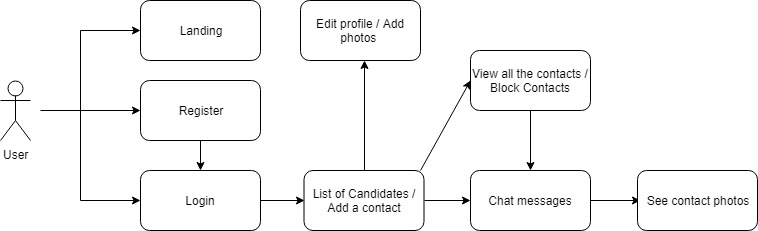
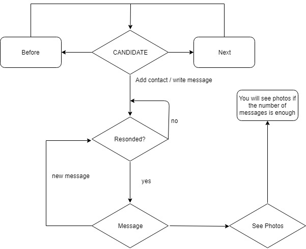
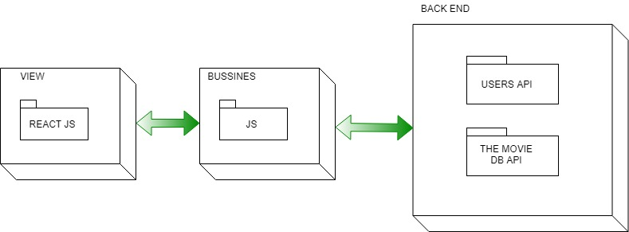
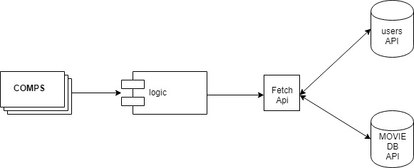
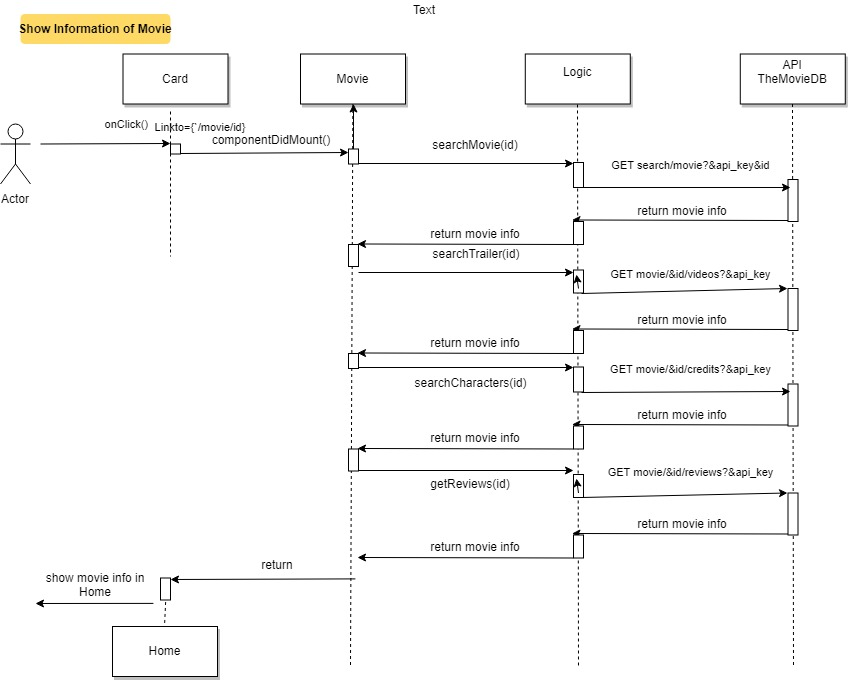
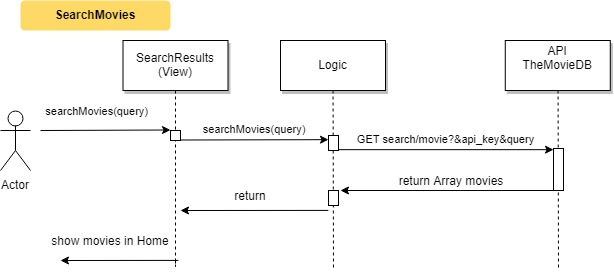
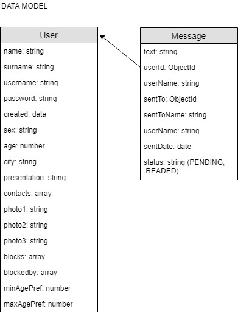
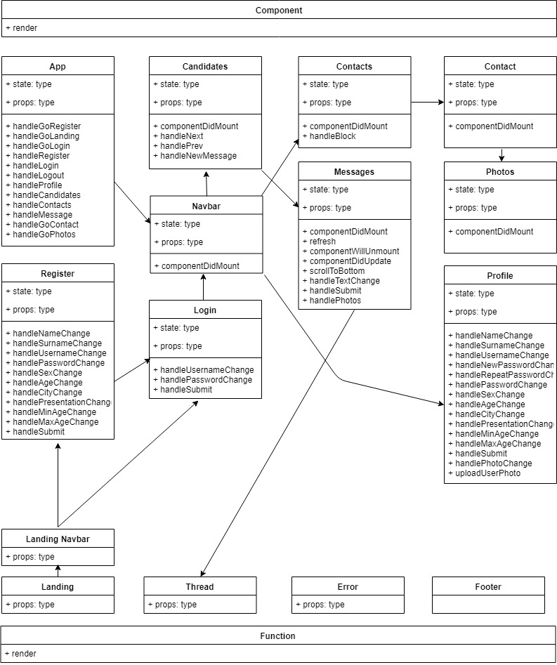

# LETS TALK documentation

## Intro

This application is a contacts app, to find interesting people and discover to each other. The photos of the user will be showed when the contacts send a number of messages between them. You can add photos to your profile and choose the city and range of age of the people you are looking for. The program will offer you a list of candidates in your city adjusted to your choosen characteristics.
All the persons have the opportunity of write to someone. But you only will be able to write again if the other responds you first. 

# Functional description

## Use Cases Diagram

## Activity Diagram

# Technical description
The front end of the application was built using React and React Router. As a database, we use The movie DB. A fantastic database of movies and series, completely updated and in diferents languages.

## Blocks Diagram

## Components Diagram

## Sequences Diagram

## Data Model Diagram

 

## Class Diagram

 

## developed by

- Francisco Fernández [Pacoscript](https://github.com/Pacoscript)

